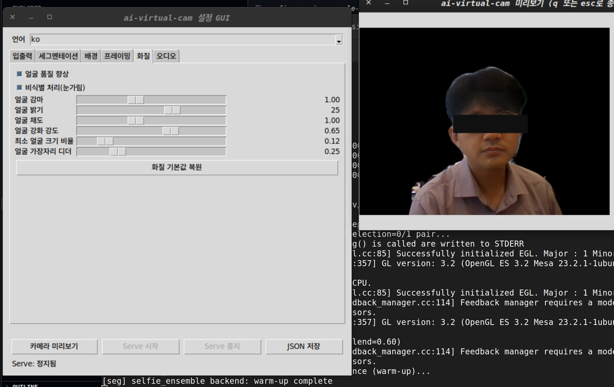
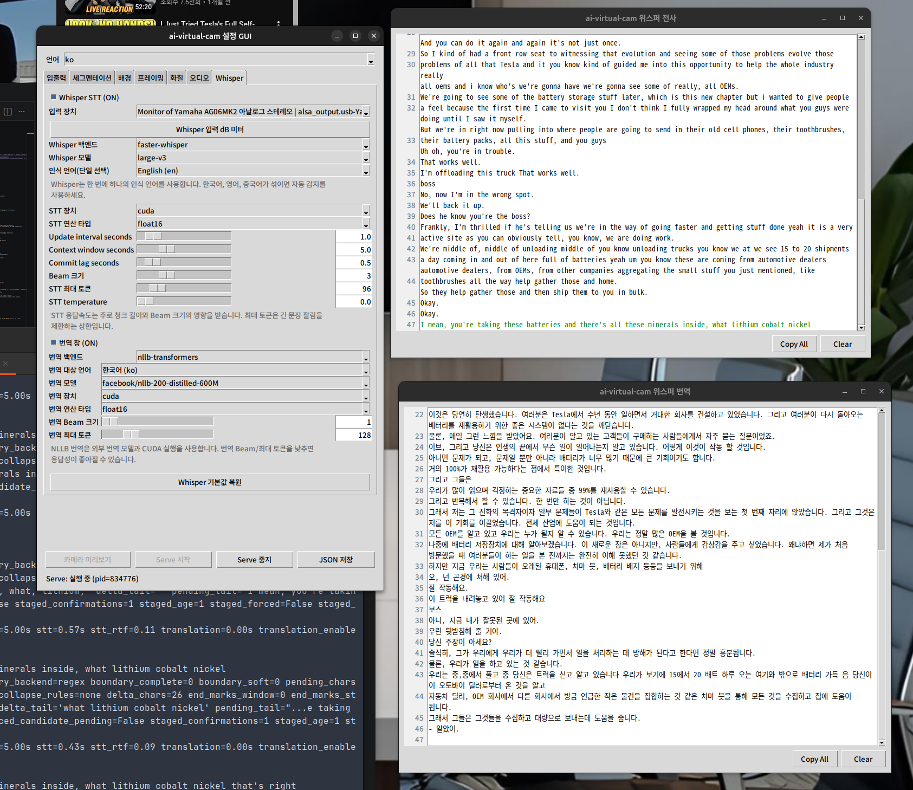

# ai-virtual-cam

`ai-virtual-cam`은 카메라 입력을 받아 인물 세그멘테이션, 배경 합성, 소프트웨어 프레이밍(줌/패닝/틸트) 후 가상카메라로 송출하는 프로젝트입니다.

## 시작하기

### 1) 설치

```bash
./bin/avc setup
```

- Linux: 런타임 의존성 설치
- Linux Docker 사용 시 `docker`, `docker compose`, `xauth`, `xhost` 포함
- macOS: OBS Studio + BlackHole 2ch + Python 런타임 의존성 설치

Linux Docker 메모:

- 기존 `docker-ce`/`docker-compose-plugin` 환경이 있으면 `setup`은 이를 재사용하고 `docker.io`로 덮어쓰지 않습니다.

Python 의존성만 재동기화:

```bash
./bin/avc env sync
```

- `.venv`를 생성/재사용하고 `requirements.txt` 기준으로 정확히 설치합니다.
- Linux의 `deepfilternet`는 기본 미설치입니다. 필요하면 `AVC_INSTALL_DEEPFILTERNET=1 ./bin/avc env sync`로 별도 시도하세요.

TensorRT 엔진을 setup 중 내려받으려면 엔진 URL을 지정합니다:

```bash
AVC_TENSORRT_ENGINE_URL="https://example.com/person-segmentation.engine" ./bin/avc setup
```

- 기본 저장 위치는 `~/.avc/models/person-segmentation.engine`입니다.
- 다른 경로는 `AVC_TENSORRT_ENGINE_PATH=/path/to/model.engine`으로 지정합니다.
- 체크섬 검증은 `AVC_TENSORRT_ENGINE_SHA256=<sha256>`으로 지정합니다.
- 기존 파일을 다시 받으려면 `AVC_TENSORRT_ENGINE_FORCE=1`을 함께 지정합니다.

### 2) 설정

```bash
./bin/avc config
```

- 저장 경로: `~/.avc/setting.json`
- 언어 선택: GUI 하단 `Language`에서 `ko`/`en` 선택
- 시작 언어 지정: `./bin/avc config --lang ko` 또는 `./bin/avc config --lang en`
- 영상: 입력 카메라, 출력 해상도/FPS, 세그멘테이션, 배경, 프레이밍
- 화질/비식별: 세그멘테이션 경계 기반 화질 보정, `비식별 처리(눈가림)` 옵션
- 오디오: `audio.enabled`, 입/출력 장치, 게이트/노이즈캔슬
- Whisper STT: 입력 장치, 로컬 모델, 인식 언어, 응답속도 파라미터
- 선택한 언어는 `setting.json`의 `meta.language`에 저장됩니다.

설정 GUI 샘플:

- 샘플 파일: [`docs/images/config-preview-sample-anon.png`](docs/images/config-preview-sample-anon.png)
- 설명: `화질` 탭에서 `비식별 처리(눈가림)` 옵션을 활성화한 상태의 미리보기 예시입니다.



Whisper 실행/번역 테스트 설정 GUI 샘플:

- 샘플 파일: [`docs/images/whisper-config-runtime-sample.png`](docs/images/whisper-config-runtime-sample.png)
- 설명: `Whisper` 탭에서 STT 입력 장치, `faster-whisper` 모델, 단일 인식 언어, NLLB 번역 백엔드, 번역 대상 언어, CUDA 장치/연산 타입, 청크 길이/Beam 크기를 함께 설정하고 실행 결과 창을 확인하는 예시입니다.
- 테스트 설정 의도: STT와 번역 모두 로컬 모델로 처리하며, 실시간성 확보를 위해 GPU 실행(`cuda`)과 반정밀도 연산(`float16`)을 사용합니다.



macOS 오디오 권장:

- `inputDevice`: 실제 마이크 장치명
- `outputDevice`: `BlackHole 2ch`
- `default` 대신 실제 장치명 저장 권장

### 3) 실행

```bash
./bin/avc serve
```

### Linux Docker 실행

호스트 준비:

- `v4l2loopback` 장치는 호스트에서 먼저 생성해야 합니다.
- 가상 카메라 생성/제거는 반드시 호스트 `./bin/avc config`에서 수행해야 합니다. (`docker config`에서는 생성/제거 불가)
- `config` GUI는 X11 전달이 필요합니다.
- PulseAudio/PipeWire를 쓸 경우 사용자 런타임 디렉터리(`/run/user/<uid>`)가 컨테이너에 마운트됩니다.
- `./bin/avc setup`은 Docker/Compose/X11 유틸까지 설치하지만, `docker` 그룹 반영을 위해 재로그인이 필요할 수 있습니다.
- `docker build` 전에 `docker info` 또는 `docker ps`가 일반 사용자로 동작해야 합니다.

이미지 빌드:

```bash
./bin/avc docker build
```

빌드 동작:

- Compose 파일 `docker/linux/compose.yml` 기준으로 Linux 런타임 이미지를 빌드합니다.
- 기본 이미지 태그는 `ai-virtual-cam-linux:latest`입니다.
- 빌드 시점에는 카메라/X11/Pulse 장치가 실제로 연결돼 있을 필요는 없습니다.

빌드 전 점검:

```bash
docker --version
docker compose version
docker ps
```

`docker ps`가 권한 오류로 실패하면:

```bash
sudo systemctl restart docker
sudo usermod -aG docker $USER
newgrp docker
```

`/var/run/docker.sock` 권한이 비정상일 때 확인:

```bash
ls -l /var/run/docker.sock
```

- 일반적으로 `root docker` 소유여야 합니다.
- `nobody:nogroup` 등으로 잘못 잡혀 있으면 Docker daemon 상태를 먼저 복구하세요.

GUI 설정:

```bash
xhost +si:localuser:$USER
./bin/avc docker config
```

- `docker config`는 설정값을 우선 사용합니다. 설정값이 없거나 유효하지 않으면 즉시 실패하며, 자동 대체 장치를 선택하지 않습니다.
- 설정은 로컬 `~/.avc/setting.json`에 저장됩니다.

스트리밍 실행:

```bash
./bin/avc docker serve
```

Docker Hub 이미지 사용:

```bash
docker pull devchan64/ai-virtual-cam:latest
docker pull devchan64/ai-virtual-cam:2026.05.26
```

- `docker serve`는 `setting.json`의 입력/출력 장치 값을 우선 사용합니다. 설정값이 없거나 장치를 열 수 없으면 즉시 실패합니다.
- `serve`는 항상 로컬 `~/.avc/setting.json` 존재 여부를 먼저 확인하고 없으면 즉시 실패합니다.
- `./bin/avc docker build` 로그는 `.tmp/docker-build-<UTC_TIMESTAMP>.log`로 저장됩니다.

운영 원칙:

- `config`와 `serve` 모두 `~/.avc/setting.json`을 동일하게 사용
- 장치 경로는 컨테이너 내부에서도 호스트와 동일한 절대 경로로 마운트
- 초기 설정 예시는 입력 `/dev/video0`, 출력 `/dev/video10`이며, 실제 실행은 저장된 설정값 기준으로 동작
- 가상 카메라 생성/삭제는 호스트 `config` 전용 기능
- `config`는 `DISPLAY` 또는 X11 소켓이 없으면 즉시 실패

### 4) 회의 앱 연결

- 카메라: `OBS Virtual Camera`(macOS) 또는 Linux 가상 카메라(`/dev/videoN`)
- 마이크(macOS): `BlackHole 2ch`
- 스피커 모니터링이 필요하면 macOS `Audio MIDI 설정`에서 `다중 출력 기기` 구성

### 5) 점검

```bash
./bin/avc doctor
```


## 명령어

모든 사용자 실행은 `./bin/avc` 단일 진입점으로 통일합니다.

```bash
./bin/avc <command>
```

- `setup`: 현재 OS 의존성 설치
- `env`: Python 환경 동기화 (`env sync`)
- `config`: GUI 설정 생성기(프리뷰 포함)
- `serve`: 저장된 설정으로 스트리밍 실행
- `docker`: Linux Docker 기반 `config`/`serve` 실행
- `audio-mixer`: 마이크 게이트 기반 가상 오디오 믹서 실행 (Linux: 실시간 입력/출력 스트림)
- `doctor`: 기본 런타임 점검

가상장치 스펙 테스트:

```bash
./bin/avc test
AVC_RUN_DEVICE_INTEGRATION_TEST=1 ./bin/avc test
```

- 기본 `./bin/avc test`는 안전 가드로 통합 테스트를 skip 합니다.
- 실제 통합 테스트는 `AVC_RUN_DEVICE_INTEGRATION_TEST=1`일 때만 실행됩니다.
- 통합 테스트는 테스트 전용 가상장치(`/dev/video42`, `ai-virtual-cam-test`, `ai-virtual-cam-test-mic`)를 생성/검증/삭제합니다.

## 개발 환경(기준)

- OS: Ubuntu 22.04.5 LTS
- Kernel: Linux 6.8.0-111-generic (x86_64)
- Python: 3.10.12
- Docker: 28.0.0
- Docker Compose: v2.33.0
- GPU: Intel Iris Xe Graphics (TigerLake-LP GT2)
- FFmpeg: 4.4.2 (Ubuntu 22.04 패키지)

참고:

- 위 정보는 최근 문서 업데이트 시점의 실제 개발/검증 환경 기준입니다.
- 환경이 다르면 장치명, 성능, 세그멘테이션/오디오 동작 특성이 달라질 수 있습니다.

## 프로젝트 개요

핵심 목적:

- 영상 품질 개선: 세그멘테이션 + 배경 합성 + 소프트웨어 프레이밍
- 비식별 처리: 얼굴 검출 기반 눈가림(옵션)
- 화질 보정: 얼굴 추적 없이 세그멘테이션 마스크 경계(edge band) 기준으로 적용
- 오디오 제어: 게이트 기반 입력 제어
- 운영 원칙: 설정값 우선, 자동 폴백 금지, 실패 시 원인 명확화

핵심 구성:

- `scripts/config/create-config-gui.py`: GUI 설정기
- `src/app/main.py`: 메인 스트리밍 실행
- `src/pipeline/*`: 영상 처리 파이프라인
- `src/audio/*`: 오디오 게이트/믹서 및 OS별 런타임
- `src/adapter/output/*`: 가상 카메라 출력 어댑터

## 플랫폼별 동작

- Linux: OBS 비의존 `v4l2loopback` 경로
- Linux Docker: 호스트 `v4l2loopback` + 컨테이너 실행 경로
- macOS: OBS Virtual Camera(`pyvirtualcam`) 경로
- macOS 오디오 루프백: BlackHole 장치 사용 권장
- CMIO 관련 기능은 폐기

### macOS 필수 체크

- `setup`으로 OBS/BlackHole 설치
- OBS에서 `Virtual Camera`를 최소 1회 Start/Stop
- 브라우저/회의앱이 먼저 켜져 있었다면 완전 종료 후 재실행

```bash
sudo systemextensionsctl list | grep -Ei "obs|camera|virtual"
pluginkit -m -A -D | grep -Ei "obs|virtual.?camera|cameraextension|coremedia"
```

### Linux 가상 카메라 생성

- `config`의 `가상 카메라 생성/제거`는 `sudo modprobe` 권한 필요
- GUI는 `sudo -n`(비대화식)으로 실행되어, 권한 없으면 즉시 실패/안내
- 기본 생성 옵션: `exclusive_caps=1`, `devices=1`, `max_buffers=2`
- 옵션 적용 실패 시 자동 폴백 없이 즉시 실패하고 재설정이 필요
- Docker 실행은 가상 카메라 생성을 대체하지 않음. 장치는 호스트에서 먼저 준비해야 함.
- Docker `config`에서 가상 카메라 생성/제거를 시도하지 말고, 호스트 `./bin/avc config`에서 먼저 생성/검증 후 Docker `serve`를 실행하세요.

수동 생성 명령(호스트):

```bash
sudo modprobe v4l2loopback devices=1 video_nr=10 card_label="ai-virtual-cam" exclusive_caps=1
```

권한 준비 후 실행:

```bash
sudo -v
./bin/avc config
```

## 운영 정책

- `설정 우선` 원칙으로 동작
- `output.device`, `audio.inputDevice`, `audio.outputDevice`, `outputCamera` 해상도/FPS/픽셀 포맷은 실행 시점에 그대로 사용
- 오디오 디바이스는 저장/로드/실행 시 자동 정규화하지 않음
- 장치/포맷 초기화 실패 시 자동 대체 없이 즉시 종료
- 에러 로그에는 실패 설정값, 원인, 권장 조치 포함
- 비식별 처리는 `faceEnhance.deidentify.enabled=true`로 활성화하며, 미리보기/serve 출력 모두에 동일 적용

### 현재 미완성 상태

- GPU 기반 모델 검증은 제한적입니다.
  - 현재는 CPU 경로 위주 동작 중심으로 검증되어 있으며, GPU(CUDA/ROCm/Metal)별 동작 안정성 및 성능 기준이 누적되지 않았습니다.
  - 동일 모델/백엔드로 `selfie_ensemble` 또는 `onnxruntime` GPU 경로 성능 비교 로그가 충분하지 않습니다.
  - GPU 환경에서는 추후 실제 회의 앱 동작, 발열/메모리 스파이크, 프레임 드랍 데이터 수집을 추가해야 합니다.
- Windows 인터페이스는 현재 미완성입니다.
  - `avc` 단일 엔트리포인트/GUI/장치 제어의 Windows UX 및 가이드가 충분히 정리되지 않았습니다.
  - 현재는 우선 Linux/macOS 중심의 사용성 기준으로 유지되고 있습니다.
- macOS 인터페이스는 현재 미완성입니다.
  - macOS 특화 UI/권한 가이드(OBS/BlackHole 및 장치 선택 UX)는 개선 여지가 큽니다.
  - `gui` 내 설정 동작 흐름은 기본 동작은 되지만, 플랫폼별 사용성 정리는 아직 진행 단계입니다.

Linux `v4l2loopback` 실패 처리 정책:

- 장치 상태가 비정상이거나 포맷 적용에 실패하면 자동 복구를 시도하지 않고 즉시 종료
- 오류 로그에 실패한 장치/포맷 설정값, 실패 원인, 권장 조치(`config`에서 가상 카메라 재생성 후 재실행)를 함께 출력

문제 발생 시 `config`에서 수정 후 재저장하고 `serve` 재실행하세요.

Linux Docker 정책:

- 컨테이너는 `AVC_INPUT_DEVICE`, `AVC_OUTPUT_DEVICE`, `~/.avc` 마운트가 정확히 들어와야만 실행
- 누락 시 자동 탐색/대체 없이 즉시 종료
- X11, Pulse/PipeWire 소켓도 누락 시 즉시 종료 또는 기능 실패로 반환

## Whisper STT 운영 가이드

Whisper 활성화:

```bash
./bin/avc config
```

- `Whisper` 탭에서 `Whisper STT`를 켜고 입력 장치를 선택합니다.
- `Whisper 입력 dB 미터`로 선택한 장치에 실제 신호가 들어오는지 확인합니다.
- `번역 창`을 켠 뒤 `번역 백엔드`를 선택합니다. `whisper`는 영어 번역만 지원하고, `nllb-transformers`는 `facebook/nllb-200-distilled-600M` 로컬 모델로 한국어/영어/중국어 대상 번역을 지원합니다.
- Linux PulseAudio/PipeWire 장치는 `alsa_input...`, `*.monitor`, `ai-virtual-cam` 같은 원본 ID를 설정값으로 저장합니다.
- Whisper 탭의 설정값은 `setting.json`의 `whisper` 블록에 저장됩니다. 주요 키는 `enabled`, `inputDevice`, `backend`, `model`, `language`, `translationEnabled`, `translationBackend`, `translationTargetLanguage`, `translationModel`, `translationDevice`, `translationComputeType`, `translationBeamSize`, `translationMaxNewTokens`, `device`, `computeType`, `chunkSeconds`, `stepSeconds`, `windowSeconds`, `commitLagSeconds`, `beamSize`, `maxNewTokens`, `temperature`입니다.

실행 동작:

- config GUI의 `Serve 시작`으로 실행하면 별도 Whisper 전사 창이 열립니다.
- CLI `./bin/avc serve`는 기본적으로 Whisper 창을 열지 않습니다.
- 전사 창은 텍스트 선택, `Ctrl+C`, `Ctrl+A`, 우클릭 `Copy`/`Copy All`을 지원합니다.
- `번역 창`을 켜면 원문 전사 창과 별도로 번역 창이 열립니다. 창 제목은 `meta.language` 설정에 따라 한글/영문으로 표시됩니다.
- 전사/번역 창에는 복사용 텍스트만 표시합니다. 시간, `[ko]` 같은 언어 태그, `전사 결과 없음` 같은 추적 로그는 표시하지 않습니다.
- stdout/stderr 로그에는 시간 prefix와 함께 모델 로딩, 입력 장치, chunk 처리, 오류 상태가 출력됩니다.
- 전사 창의 위치와 크기는 `setting.json`의 `meta.whisperWindowGeometry`, 번역 창의 위치와 크기는 `meta.whisperTranslationWindowGeometry`에 저장되고 다음 실행 때 재사용됩니다.
- 설정 GUI 자체의 위치와 크기는 `meta.windowGeometry`, 카메라 미리보기 창은 `meta.previewWindowGeometry`, 설정 모달은 `meta.audioTuneWindowGeometry`/`meta.audioGateTestWindowGeometry`/`meta.inputMeterWindowGeometry`로 `JSON 저장` 시 `setting.json`에 저장됩니다.

모델/언어 설정:

- 기본 모델은 `large-v3`, CUDA 환경 기본 연산은 `float16`입니다.
- `./bin/avc setup`은 Linux에서 `faster-whisper`, NLLB 번역용 `transformers`/`sentencepiece`, CUDA 런타임 의존성을 설치하고, PyTorch는 기본적으로 CUDA 12.8 휠 인덱스에서 설치합니다.
- setup은 Whisper/STT 모델을 미리 내려받을지 질의합니다. 비대화형 실행에서는 건너뛰며, `AVC_DOWNLOAD_WHISPER_MODELS=1 ./bin/avc setup` 또는 `./bin/avc setup --download-whisper-models`로 강제 다운로드할 수 있습니다. 다운로드 대상은 기본 Whisper 모델, 언어별 문장 경계/후처리 모델, NLLB 번역 모델입니다.
- 인식 언어는 단일 선택입니다. 한국어/영어/중국어가 섞이면 `자동 감지 (auto)`를 사용하고, 한 언어가 주로 나오면 `한국어 (ko)`, `English (en)`, `中文 (zh)` 중 하나로 고정합니다.
- `whisper` 번역 백엔드는 Whisper의 `translate` 경로를 사용하므로 영어 번역만 지원합니다. 한국어/영어/중국어 대상 번역은 `nllb-transformers` 백엔드를 사용합니다.
- `nllb-transformers` 번역을 선택하면 Whisper는 STT 전사(`task=transcribe`)만 수행하고, 번역은 외부 NLLB 텍스트 번역 경로에서만 수행합니다. 이때 `task=translate` 설정은 유효하지 않습니다.
- NLLB 번역은 실시간 성능을 위해 `translationDevice=cuda`, `translationComputeType=float16`, `translationBeamSize=1`, `translationMaxNewTokens=128`을 기본 테스트값으로 사용하며 실행 단계의 자동 CPU fallback은 허용하지 않습니다.
- 테스트 설정은 STT 장치와 번역 장치를 모두 `cuda`로 두고, 연산 타입을 `float16`으로 맞춥니다. Whisper large-v3와 NLLB 600M은 CPU/float32에서 지연이 커질 수 있으므로, 실시간 회의 자막처럼 짧은 주기로 전사/번역 창을 갱신하려면 GPU 텐서코어를 쓰는 반정밀도 실행이 유리합니다.
- `float16`은 메모리 사용량과 연산량을 줄여 응답성을 높이는 대신, GPU와 PyTorch/CUDA 빌드가 해당 아키텍처를 지원해야 합니다. 지원하지 않으면 자동 CPU fallback 대신 즉시 실패하도록 두고, CUDA 빌드나 설정을 명확히 수정합니다.

응답속도 조정:

- `청크/윈도우 길이(초)`(`chunkSeconds`, `windowSeconds`): 최근 몇 초의 오디오 문맥을 Whisper에 전달할지 결정합니다. 길게 잡으면 빠른 발화의 문장 완성도와 앞뒤 문맥 안정성에 유리하지만, tail echo와 후보 리비전 관리 부담이 늘 수 있습니다. 기본 추천값은 `7.5`초입니다.
- `갱신 주기(초)`(`stepSeconds`): 몇 초마다 새 STT 요청을 만들지 결정합니다. 기본 추천값은 `1.5`초이며, 낮추면 화면 갱신은 빨라지지만 같은 문맥을 반복 처리하는 비율이 커집니다.
- `확정 지연(초)`(`commitLagSeconds`): 윈도우 끝단의 불안정한 tail을 즉시 확정하지 않기 위한 보류 구간입니다. 기본 추천값은 `0.8`초입니다.
- `Beam 크기`(`beamSize`): 디코딩 후보를 몇 갈래로 탐색할지 결정합니다. `1`은 가장 빠른 greedy 디코딩에 가깝고 지연을 줄이는 데 유리합니다. 값을 키우면 후보 탐색이 늘어 일부 발화의 정확도와 안정성이 좋아질 수 있지만, large-v3에서는 GPU 사용량과 디코딩 시간이 늘어 응답이 늦어질 수 있습니다.
- large-v3에서 빠른 발화와 문장 누락이 문제라면 우선 `windowSeconds=7.5`, `stepSeconds=1.5`, `commitLagSeconds=0.8`, `beamSize=3`, `temperature=0.0` 조합을 시작점으로 사용하세요. `maxNewTokens=96`은 속도 튜닝값이라기보다 긴 출력 생성을 막는 상한값입니다.
- 문장이 여전히 자주 끊기거나 앞뒤 문맥을 놓치면 `windowSeconds`를 `9.0`까지 늘려 비교합니다. tail echo가 늘면 `commitLagSeconds`를 `1.0`까지 올리거나 `windowSeconds`를 다시 낮춥니다.
- 속도는 충분하지만 고유명사나 짧은 발화 인식이 흔들리면 `beamSize`를 `3` 또는 `5`로 올려 비교합니다. 문장이 실제로 잘릴 때만 `maxNewTokens`를 `128` 또는 `192`로 올립니다. 짧은 청크에서는 이 값이 응답속도에 거의 영향을 주지 않을 수 있습니다.
- 번역까지 포함한 지연은 NLLB `translationBeamSize`와 `translationMaxNewTokens`의 영향을 받습니다. 실시간 응답성은 `translationBeamSize=1`, `translationMaxNewTokens=128`에서 시작하고, 번역 품질이나 긴 문장 완성도가 부족하면 각각 `3` 또는 `256`으로 올려 비교합니다.
- 실시간 번역은 기본적으로 확정된 final 전사 문장만 대상으로 합니다. staged/partial 문장은 뒤 청크에서 수정될 가능성이 높아 중복 번역과 premature translation을 만들 수 있으므로 기본값에서 번역하지 않습니다. 상세 설계와 참고 자료는 [`docs/2026-06-13-whisper-feature-design.md`](docs/2026-06-13-whisper-feature-design.md)를 확인합니다.

성능 추적 테스트:

```bash
python3 -m unittest tests.unit.test_whisper_performance_tracking
```

- `test_whisper_performance_tracking.py`는 누적 Whisper 로그에서 수집한 revision, distinct, collapse, stability 관측 케이스를 성능 추적용으로 실행합니다.
- 이 테스트의 unittest 성공/실패는 품질 통과율을 의미하지 않습니다. 테스트가 실행되면 `[whisper-tracking] ... rate=... target>=... rate_gap=...` 지표를 출력하고, 이 지표를 올려가는 것을 개선 목표로 삼습니다.
- 새 로그에서 중복/누락/잘못된 revision 사례가 보이면 tracking case를 추가하고, 이후 알고리즘 변경으로 rate가 오르고 gap이 줄어드는지 비교합니다. 상세 기준과 근거는 [`docs/2026-06-13-whisper-feature-design.md`](docs/2026-06-13-whisper-feature-design.md)를 따릅니다.

## 오디오 운영 가이드

오디오 활성화:

```bash
./bin/avc config       # 오디오 탭에서 Audio mixer true/false 설정
./bin/avc serve        # audio.enabled 값을 그대로 사용
```

오디오 게이트 정책:

- `thresholdDb` + `minVoiceBandRatio`를 함께 사용
- 음악/환경소음으로 게이트가 잘못 열리는 상황을 억제
- `thresholdDb`, `hysteresisDb`, `minVoiceBandRatio`를 GUI에서 조정 가능
- `게이트 자동 튜닝`으로 무음/발화 기준값 추천 적용
- 노이즈캔슬 backend:
  - macOS: `none`, `rnnoise`
  - Linux: `none`, `rnnoise`, `deepfilternet`

### macOS 오디오 가상장치(BlackHole)

설치/준비:

1. `./bin/avc setup` 실행 (BlackHole 2ch 설치 포함)
2. 필요 시 OBS Virtual Camera를 1회 Start/Stop

`config` 설정:

1. `inputDevice`: 실제 마이크 장치명 선택
2. `outputDevice`: `BlackHole 2ch` 선택
3. `default` 대신 실제 장치명 저장 권장

회의 앱 연결:

1. 회의 앱 마이크 입력 장치를 `BlackHole 2ch`로 선택
2. 모니터링이 필요하면 macOS `Audio MIDI 설정`에서 `다중 출력 기기`(BlackHole + 스피커) 구성

검증/장애 대응:

1. `serve` 오류에 `available=[...]`가 나오면 해당 정확한 장치명을 `audio.outputDevice`에 설정
2. 장치 미노출 시 `config` 재실행으로 목록 재조회
3. 반영 지연 시 재부팅
4. 필요 시 `brew reinstall --cask blackhole-2ch`

### Linux 오디오 가상장치(PulseAudio)

- `config`는 오디오 장치 값을 `setting.json`에 원본 ID 그대로 저장
  - 예: `alsa_input...__source`, `ai-virtual-cam`
- 오디오 경로(GStreamer):
  - 레벨 모니터: `input src -> level -> fakesink`
  - 출력 스트림: `input src` 또는 `audiotestsrc wave=silence` -> `pulsesink`
- 설정값이 런타임에서 열 수 없으면 자동 변환/폴백 없이 종료

권장 운영 절차:

1. `config` 오디오 탭에서 입력(source)/출력(sink)을 명시 선택
2. `serve` 실행 후 게이트 transition 로그 확인
3. source/sink가 바뀌었으면 `config` 재저장 후 재실행

## 문제 해결

- `OBS Virtual Camera가 준비되지 않았습니다`:
  OBS에서 Virtual Camera를 1회 시작 후 `./bin/avc serve` 재실행
- GUI 실행 시 `tkinter` 오류:
  `./bin/avc setup`으로 `.venv`/Tk 의존성 재설치
- `No module named cv2`:
  `./bin/avc setup`으로 공통 `.venv` 의존성 재정렬
- `audio output device open failed: ... No output device matching 'BlackHole 2ch'`:
  - `config` 재실행 후 오디오 장치 목록 재선택/저장
  - 에러의 `available=[...]`에 표시된 실제 장치명을 `audio.outputDevice`에 설정
  - macOS 재부팅 후 재시도
  - 필요 시 `brew reinstall --cask blackhole-2ch`

## GUI 기능

- 배경 모드 선택: 블러, 크로마, 이미지
- 크로마 컬러피커
- 세그멘테이션 실시간 조정: threshold, edge/blend, selfie 옵션, 백엔드별 추가 엔진 옵션(폼 기반)
- 프레이밍 실시간 조정: margin, zoom/pan/tilt smoothing, PID, X/Y 오프셋
- 프리뷰 창에서 처리 결과 확인
- 카메라 입력 모드 후보 기반(해상도/FPS 세트)
- 화질 탭: 감마/오프셋/채도/강도 보정(세그멘테이션 경계 기준 적용)
- `오디오 게이트 테스트`, 각 탭별 기본값 복원 버튼
- `Whisper` 탭: STT 입력 장치, dB 미터, 모델/언어, 응답속도 조정
- 탭 순서: `입출력 -> 세그멘테이션 -> 배경 -> 프레이밍 -> 화질 -> 오디오 -> Whisper`
- `faceEnhance` 구키(`brightness`, `blend`, `minSizeRatio`, `edgeDither`) 하위호환은 지원하지 않음

## 설정 예시

```json
{
  "meta": {
    "language": "en"
  },
  "inputCamera": {
    "devicePath": "/dev/video0",
    "width": 1280,
    "height": 720,
    "fps": 30,
    "crop": { "x": 0, "y": 0, "width": 1280, "height": 720 },
    "softwareZoom": 1.0
  },
  "outputCamera": {
    "devicePath": "/dev/video10",
    "backend": "v4l2loopback",
    "width": 640,
    "height": 480,
    "fps": 30
  },
  "segmentation": {
    "backend": "selfie_ensemble",
    "threshold": 0.6,
    "edgeSmoothness": 0.5,
    "blendFeather": 0.35,
    "selfie": { "modelSelection": 0, "temporalSmoothing": 0.25 },
    "engineOptions": {
      "selfie_ensemble": {
        "modelBlend": 0.6,
        "temporalAlpha": 0.55,
        "maskBlur": 5,
        "morphOpen": 3,
        "morphClose": 5,
        "maskGamma": 0.9
      },
      "tensorrt": {
        "enginePath": "/path/to/person-segmentation.engine",
        "inputName": "input",
        "outputName": "mask"
      }
    }
  },
  "background": {
    "mode": "chroma",
    "chromaColor": [0, 0, 0]
  },
  "crop": {
    "margin": 0.25,
    "panSmoothing": 0.85,
    "tiltSmoothing": 0.85,
    "zoomSmoothing": 0.8,
    "upperBodyBias": 0.0,
    "upperBodyRatio": 0.6,
    "upperBodyEdgeSmoothing": 0.35,
    "zoom": 1.2,
    "panPidKp": 0.35,
    "panPidKi": 0.01,
    "panPidKd": 0.12,
    "tiltPidKp": 0.35,
    "tiltPidKi": 0.01,
    "tiltPidKd": 0.12,
    "panTargetOffsetX": 0.0,
    "panTargetOffsetY": 0.0
  },
  "faceEnhance": {
    "enabled": true,
    "gamma": 1.1,
    "offset": 10.0,
    "saturation": 1.1,
    "strength": 0.55,
    "minRegionRatio": 0.12,
    "edgeNoise": 0.25,
    "deidentify": {
      "enabled": true
    }
  },
  "audio": {
    "enabled": true,
    "inputDevice": "alsa_input.pci-0000_00_1f.3-platform-skl_hda_dsp_generic.HiFi__hw_sofhdadsp_6__source",
    "outputDevice": "ai-virtual-cam",
    "sampleRate": 48000,
    "channels": 1,
    "frameMs": 20,
    "denoise": {
      "enabled": true,
      "backend": "none",
      "strength": 0.5
    },
    "gate": {
      "enabled": true,
      "thresholdDb": -40.0,
      "hysteresisDb": 4.0,
      "attackMs": 30,
      "holdMs": 160,
      "releaseMs": 2000,
      "openGain": 1.0,
      "closedGain": 0.0,
      "minVoiceBandRatio": 0.5
    }
  },
  "whisper": {
    "enabled": true,
    "inputDevice": "alsa_input.pci-0000_00_1f.3-platform-skl_hda_dsp_generic.HiFi__hw_sofhdadsp_6__source",
    "backend": "faster-whisper",
    "model": "large-v3",
    "language": "ko",
    "task": "transcribe",
    "translationEnabled": true,
    "translationTargetLanguage": "ko",
    "translationBackend": "nllb-transformers",
    "translationModel": "facebook/nllb-200-distilled-600M",
    "translationDevice": "cuda",
    "translationComputeType": "float16",
    "translationBeamSize": 1,
    "translationMaxNewTokens": 128,
    "device": "cuda",
    "computeType": "float16",
    "chunkSeconds": 7.5,
    "stepSeconds": 1.5,
    "windowSeconds": 7.5,
    "commitLagSeconds": 0.8,
    "beamSize": 3,
    "maxNewTokens": 96,
    "temperature": 0.0
  }
}
```

Linux 출력 예시:

```json
{
  "outputCamera": {
    "devicePath": "/dev/video10",
    "backend": "v4l2loopback",
    "width": 640,
    "height": 480,
    "fps": 30
  }
}
```

- `/dev/video10`은 반드시 `Video Output` capability가 있는 `v4l2loopback` 장치여야 합니다.
- 장치 상태 확인: `v4l2-ctl -D -d /dev/video10`
